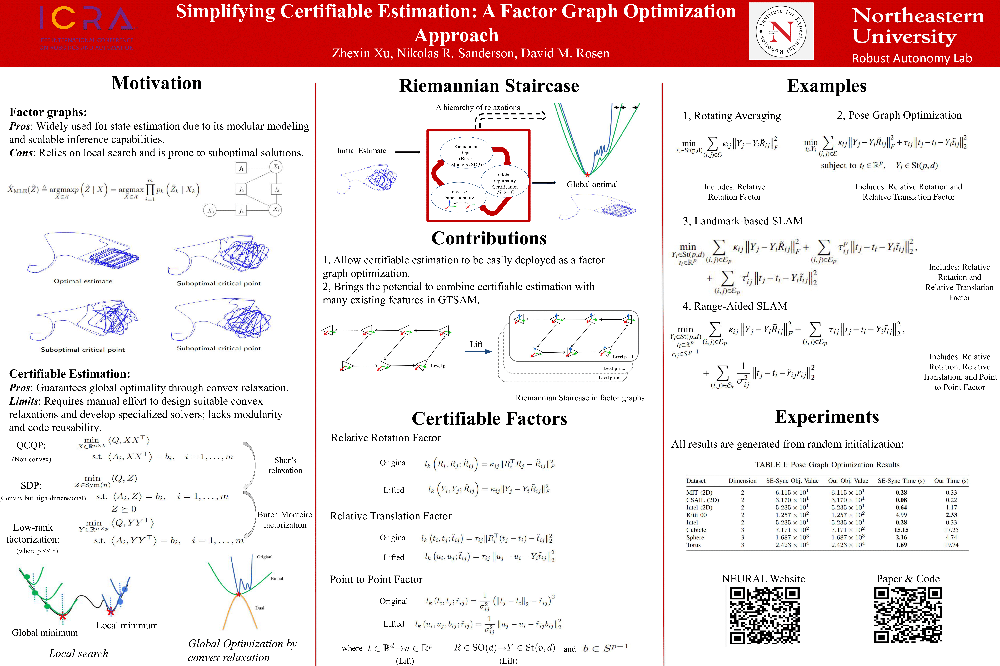
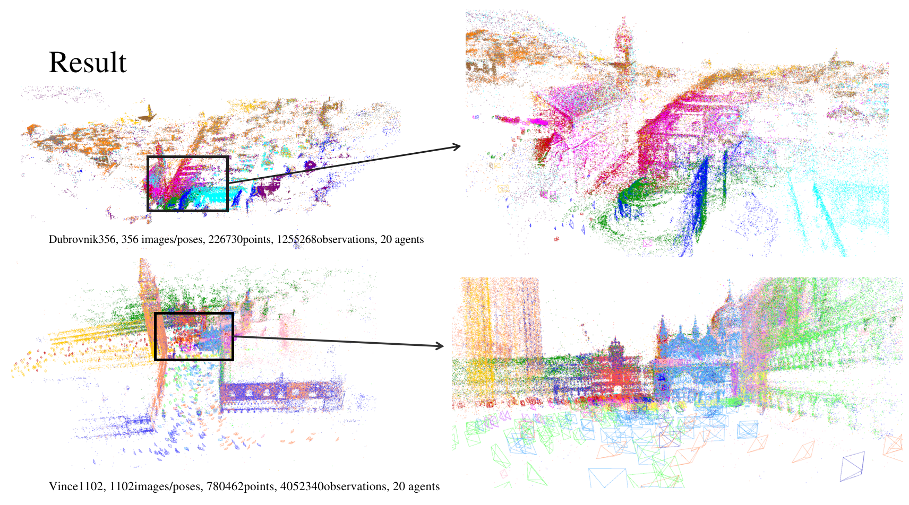



I’m trying to explore and address fundamental problems in robotic state estimation using tools from optimization, differential geometry, probability theory, and information theory. Coming from an engineering background, I also strive to translate these ideas into practical systems — such as high-performance C++ libraries and field robotics experiments.

The dream seems a little bit ambitious, and I’m still learning along the way:)

# Current research

My research focuses on advancing optimization techniques for robotic state estimation and navigation, particularly in SLAM back-ends. I am currently working on certifiable (globally optimal) algorithms, robust certifiable methods, and distributed optimization. I am interested in both foundational algorithmic problems and the development of novel applications enabled by these techniques — for example, designing velocity-related certifiable factors to extend certifiable algorithms to inertial navigation systems.

## Certifiable Estimation

1, Simplifying Certifiable Estimation with Factor Graphs - Theory and System (Preprint coming soon!)

To lower the barrier to entry for certifiable methods, we propose a **certifiable factor-graph optimization** framework built entirely on **GTSAM**. It:

1. Makes explicit the theoretical connection between certifiable estimation via Burer-Monteiro factorization and factor-graph optimization.
2. Makes certifiable methods accessible to systems already using factor-graph inference, enabling new applications even for users familiar only with local search.
3. Facilitates rapid development of new certifiable algorithms with minimal implementation effort.

[Certifiable Factors](https://github.com/NEU-RAL/CertifiableFactors) (Workshop version, new code base will be released soon!)

Workshop Version Poster: 

2, Robust certifiable estimation. 

Design robust algorithms for certifiable estimation based on Burer–Monteiro factorization, aiming to solve large-scale problems such as pose graph optimization with both performance guarantees and resilience to outlier corruption.

3, Incremental certifiable estimation.

## Distributed Optimization

1, Distributed second-order bundle adjustment solver.(In preparation of a preprint)

2, Distributed certifiable estimation. 

Based on our certifiable factors and distributed second-order optimization algorithm, trying to achieve faster convergence than the currently leading RBCD-based methods.

