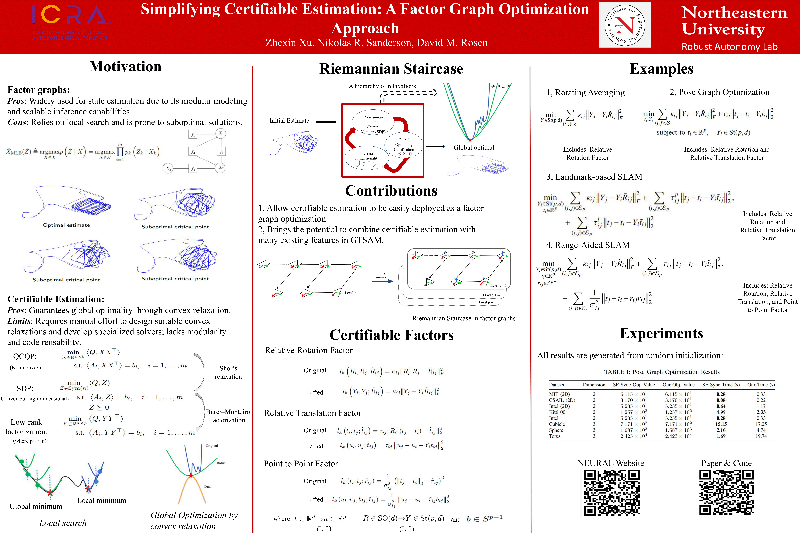
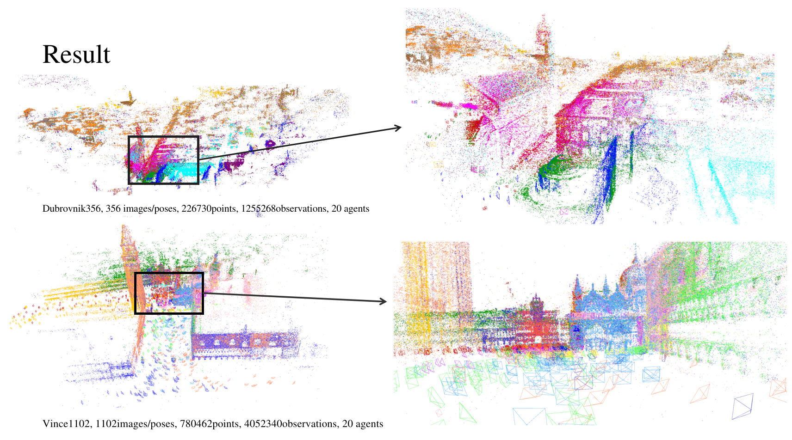



# Current research

## Certifiable Estimation

1, Trying to make certifiable estimation implementation easier and used in more real robotics application (ongoing...), and brings more developed feature (like incremental estimation and robust estimation) to certifiable algorithm. (ongoing...)

[Certifiable Factors](https://github.com/NEU-RAL/CertifiableFactors)

 

2, Robust certifiable estimation. (learning and exploring...)

## Distributed Optimization

1, (More efficient and faster) Distributed bundle adjustment solver. (ongoing...)

2, Distributed certifiable estimation. (ongoing...)

Based on our certifiable factors and distributed second-order optimization algorithm, trying to achieve faster convergence than the currently leading RBCD-based methods.

# Other research interests

## Large-scale and long-term autonomous operation

1, Sparsification of both nodes (i.e., point cloud points or landmarks) and edges (i.e., measurements) in a principled and mathematically provable manner, is a potential approach to address computational and memory considerations.

## Information-based algorithm

information-based planning, mapping, calibration...

Active SLAM...
